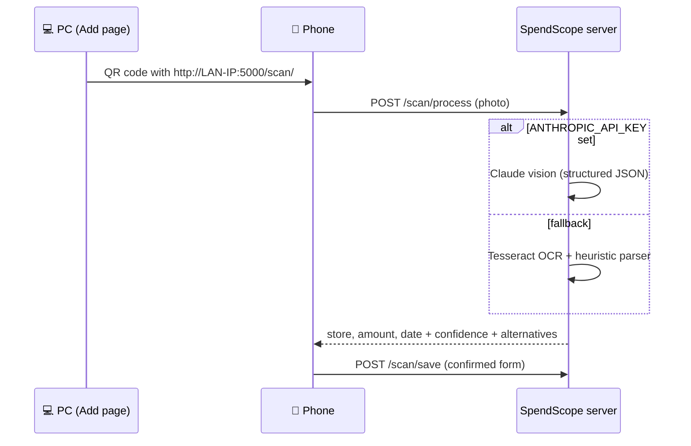

<div align="center">

# 💶 SpendScope

**A private, self-hosted household budget book with receipt scanning and a Bayesian spending forecast.**

[](https://github.com/ChristianAbele02/SpendScope/actions/workflows/ci.yml)


[](LICENSE)

Snap a receipt with your phone, confirm the pre-filled amount, and see how the month is going:
money spent, budget left and the probability of going over.

[Features](#-features) ·
[Quick start](#-quick-start) ·
[Receipt scanning](#-receipt-scanning) ·
[Configuration](#%EF%B8%8F-configuration) ·
[How the forecast works](#-how-the-forecast-works) ·
[Development](#-development)

</div>

---

## ✨ Features

| | |
|---|---|
| 📊 **Dashboard** | Spend, remaining budget, transactions and daily average for the current budget period, a year-over-year comparison and per-category limit bars |
| 🔮 **Forecast** | End-of-period projection with a 90% credible interval and the probability of exceeding the budget |
| 📱 **Receipt scanning** | Scan a QR code on the PC, photograph the receipt on your phone, and get store, amount and date extracted by Claude vision or local Tesseract OCR |
| 🧾 **Expense list** | Filters (year, month, category, store, search), inline editing, bulk re-categorisation, undo for edits and deletions, anomaly badges, CSV/JSON export |
| 📈 **Statistics** | Multi-year trends, year-over-year bars, stacked categories over time, best and worst months, shopping intervals for groceries and fuel |
| 🎯 **Budgets** | Budget rules with effective dates, per-category monthly limits and a configurable period start day (e.g. payday) |
| 🏷️ **Auto-categorisation** | Store names mapped to categories by keyword; override per entry or in bulk |
| 🔗 **Store aliases** | Merge spellings ("REWE Markt" → "Rewe") for display and statistics without rewriting stored data |
| 🧠 **Receipt sample DB** | Upload reference receipts per store; the OCR parser learns which keyword marks the total |
| 🌍 **DE / EN** | Complete German and English interface, including locale-aware currency formatting |

Everything runs locally: one SQLite file, no account, no cloud service required.

## 🚀 Quick start

Requires **Python 3.11+**. Commands are for Windows PowerShell; on Linux/macOS activate with `source venv/bin/activate`.

```powershell
git clone https://github.com/ChristianAbele02/SpendScope.git
cd SpendScope

python -m venv venv
.\venv\Scripts\activate
pip install -r requirements.txt     # exact, tested versions
pip install -e . --no-deps

python run.py
```

Open **http://localhost:5000**. A phone on the same Wi-Fi reaches the app at `http://<your-PC-IP>:5000`.

> [!TIP]
> The database (`data/expenses.db`) is created on first start, migrated to the latest schema on every
> start and seeded with the default budget rules. Before any schema change touches an existing
> database, a copy is saved to `data/backups/`.

### Importing historical data

Place a CSV named `expenses_raw.csv` in the project root (it is git-ignored, so it never ends up
in the repository) and open **Import**, or use the CLI:

```powershell
flask --app run import-csv                 # append, skipping duplicates
flask --app run import-csv other.csv       # import a different file
```

| Column | Format |
|---|---|
| `Datum` | `DD/MM/YYYY` |
| `Laden` | store name, e.g. `Aldi`, or `Sonstige` with the real name in *Detail* |
| `Ausgaben` | amount in euros (comma or dot); negative for refunds |
| `Überschuss` | ignored |
| `Detail` | optional store detail |

The import only **reads** the CSV. By default it appends new rows and skips rows whose
date, store and amount already exist, so manually added and scanned entries are preserved.
A full replace is available but requires an explicit confirmation.

## 📱 Receipt scanning



Each field on the phone gets a confidence badge (green ≥ 85%, yellow ≥ 60%, red below), and
uncertain values come with tappable alternatives.

| Backend | When it is used | Setup |
|---|---|---|
| **Claude vision** | `ANTHROPIC_API_KEY` is set (backend `auto`) | `pip install -e ".[llm]"` and set the key |
| **Tesseract OCR** | No key, or the API call failed | Install the Tesseract binary (below) |
| *Manual* | Neither available | The form simply opens empty |

<details>
<summary><b>Installing Tesseract</b></summary>

| OS | Installation |
|---|---|
| Windows | [UB Mannheim installer](https://github.com/UB-Mannheim/tesseract/wiki); the default path is picked up automatically |
| Linux | `sudo apt install tesseract-ocr tesseract-ocr-deu` |
| macOS | `brew install tesseract tesseract-lang` |

For Tesseract, upload a few reference receipts per store under **Receipt DB**. SpendScope learns
which keyword (`SUMME`, `GESAMT`, `ZU ZAHLEN`, ...) marks the total and whether the amount sits on
the same or the next line.

</details>

## ⚙️ Configuration

All settings live in [`config.py`](config.py) and can be overridden with environment variables.

| Variable | Default | Purpose |
|---|---|---|
| `PERIOD_START_DAY` | `7` | Day a budget period starts (`1` = calendar months). With `7`, an expense on 2 April counts towards March |
| `ANTHROPIC_API_KEY` | unset | Enables the Claude vision backend |
| `RECEIPT_EXTRACTION_BACKEND` | `auto` | `auto`, `claude` or `tesseract` |
| `RECEIPT_EXTRACTION_MODEL` | `claude-opus-4-8` | Vision model; `claude-haiku-4-5` is cheaper |
| `TESSERACT_CMD` | UB Mannheim path | Tesseract binary; falls back to `PATH` if missing |
| `DATABASE_URL` | `sqlite:///data/expenses.db` | SQLAlchemy database URI |
| `RECEIPT_SAMPLES_DIR` | `data/receipt_samples` | Where reference receipt images are stored |
| `SECRET_KEY` | development key | Signs the session cookie; **set this** on a shared network |
| `FLASK_DEBUG` | `0` | `1` enables the debugger (never on an untrusted network) |

Budget rules, category limits and store aliases are managed in the UI under **Settings**.
Each budget period uses the newest rule whose *effective from* date is on or before the period's start.

## 🔮 How the forecast works

The dashboard forecast treats the remaining spend of the period as a compound sum
*R = X₁ + … + X_N* of an unknown number of purchases *N* with unknown amounts *X*:

- **How often you shop.** The daily purchase rate gets a Gamma prior fitted to the previous six periods
  (empirical Bayes, capped at 45 days of prior weight) and is updated with this period's purchases.
  The number of remaining purchases then follows a Negative Binomial distribution.
- **How much you spend per purchase.** The mean amount gets a conjugate Normal prior centred on the
  historical mean (capped at 25 pseudo-purchases) and is updated with this period's amounts.
- **Combining both.** The mean and variance of *R* are combined analytically and summarised with a
  Normal approximation. This gives the expected total, a 90% credible interval and *P(total > budget)*.

Refunds lower the actual total but are excluded from the purchase model. The grocery and fuel trip
counts on the card are shown for context only and do not enter the forecast.
The implementation and its assumptions are documented in [`app/stats.py`](app/stats.py).

## 🗂️ Project structure

```text
SpendScope/
├── run.py                  # Entry point and `import-csv` CLI command
├── config.py               # Settings (env-overridable) and budget seed
├── app/
│   ├── __init__.py         # App factory, template globals
│   ├── models.py           # Expense, BudgetPeriod, ChangeLog, CategoryBudget,
│   │                       #   StoreAlias, ReceiptSample, StoreProfile
│   ├── parser.py           # Category keyword map, CSV import
│   ├── stats.py            # Periods, aggregations, forecast, anomaly detection
│   ├── extraction.py       # Claude vision receipt backend
│   ├── forms.py            # Form validation, safe redirects
│   ├── translations.py     # DE/EN strings, t() and |eur filter
│   ├── routes/             # main, api, scan, settings blueprints
│   ├── templates/          # Jinja2 templates (Bootstrap 5 dark)
│   └── static/             # charts.js, style.css, vendored Bootstrap & Chart.js
├── migrations/             # Alembic schema migrations (Flask-Migrate)
├── tests/                  # pytest suite (isolated temporary database)
├── requirements.txt        # pinned runtime lock (uv pip compile)
├── requirements-dev.txt    # pinned runtime + dev lock
└── data/                   # expenses.db, receipt samples, backups (git-ignored)
```

### Categories

| Category | Matched keywords |
|---|---|
| Lebensmittel | Aldi, Lidl, Rewe, Penny, Kaufland, Edeka, Marktkauf, Combi, Netto, Pollmeier |
| Tanken | Tanken |
| Drogerie | Rossmann, DM, Müller, Bravo, Rituals |
| Ausgehen | Ausgehen, Italiener, Subway, Türke, Pommes, Restaurant, Freibad, H2O |
| Einrichtung | Ikea, Jysk |
| Online | Amazon |
| Baumarkt | OBI, Toom, WEZ |
| Auto | Waschstraße, Parken |
| Sonstiges | Action, Laden and everything unmatched |

Matching is case-insensitive on word boundaries (`DM` never matches inside `Sandmann`).
Edit `STORE_CATEGORY_MAP` in [`app/parser.py`](app/parser.py) to extend it.

## 🛠️ Development

```powershell
pip install -r requirements-dev.txt
pip install -e . --no-deps

ruff check .        # lint
mypy                # type check
pytest              # tests (never touch data/ or expenses_raw.csv)
```

GitHub Actions runs all three on Python 3.11 and 3.12 with the pinned dev lock for every push and
pull request. Dependency updates are done manually by regenerating the lock files (below).

### Changing the database schema

Models live in `app/models.py`; every change needs a migration, otherwise
`tests/test_migrations.py` fails.

```powershell
flask --app run db migrate -m "add xyz column"   # review the file in migrations/versions/
flask --app run db upgrade                        # also runs automatically on app start
```

### Updating dependencies

Loose ranges live in `pyproject.toml`; the lock files pin every package, including transitive ones:

```powershell
pip install uv
uv pip compile pyproject.toml --extra llm --universal --python-version 3.11 -o requirements.txt
uv pip compile pyproject.toml --extra dev --extra llm --universal --python-version 3.11 -o requirements-dev.txt
pip install -r requirements-dev.txt   # then run the checks above
```

## 🔒 Privacy and safety notes

- All data stays on your machine. Receipt photos leave it only when the Claude backend is enabled.
- `data/` (database, receipt images, automatic backups) and `expenses_raw.csv` are git-ignored.
  Back up `data/expenses.db` regularly; it is a single file.
- The server binds to `0.0.0.0` so your phone can reach it. It has no login, so only run it on a
  network you trust, and set `SECRET_KEY`.

## 🧭 Roadmap

- [ ] Line-item extraction and per-item categories from receipts
- [ ] Desktop review queue for receipts uploaded from the phone
- [ ] Auto-save scans when all fields have high confidence
- [ ] CSRF protection for all forms

## 📄 License

[MIT](LICENSE) © Christian Abele
